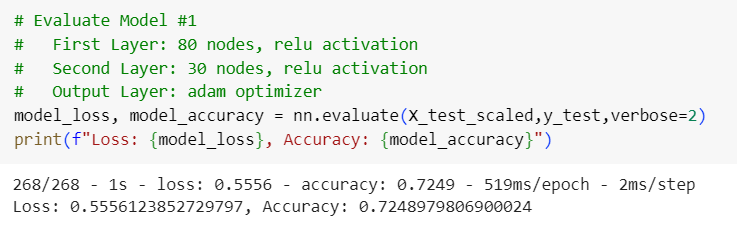
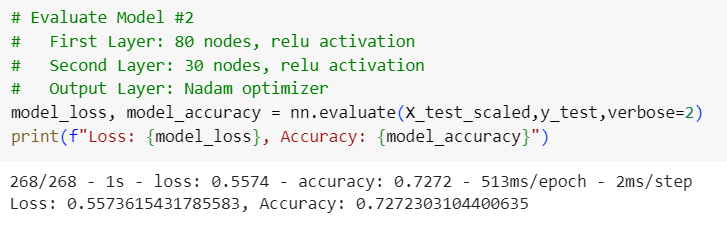
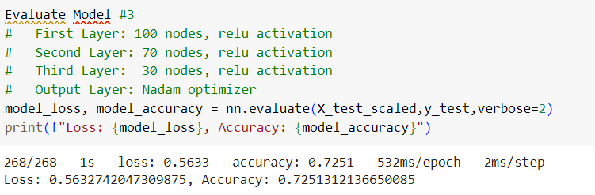
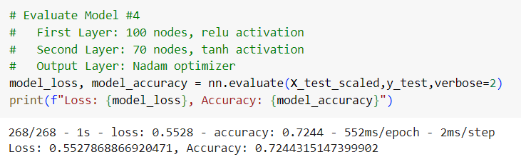
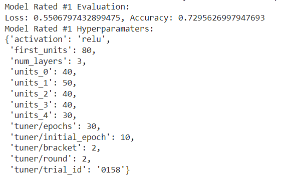

# Deep Learning Challenge

## Background
The nonprofit foundation Alphabet Soup wants a tool that can help it select the applicants for funding with the best chance of success in their ventures. The foundation has provided a CSV file containing more than 34,000 organizations that have received funding from them over the years. This dataset contains metadata for each organization including the following:

* EIN and NAME—Identification columns
* APPLICATION_TYPE—Alphabet Soup application type
* AFFILIATION—Affiliated sector of industry
* CLASSIFICATION—Government organization classification
* USE_CASE—Use case for funding
* ORGANIZATION—Organization type
* STATUS—Active status
* INCOME_AMT—Income classification
* SPECIAL_CONSIDERATIONS—Special considerations for application
* ASK_AMT—Funding amount requested
* IS_SUCCESSFUL—Was the money used effectively

## Overview of Analysis
The purpose of the analysis is to build a deep learning model to predict whether or not an applicant will be successful if they receive funding. To standardize and maximize memory and processing resources, the analysis was completed in Google Collaboratory in a Jupyter notebook. The process for analyzing the data is described below:
1. Read the CSV file into a Pandas dataframe.
2. Preprocess the data as follows:
    * Remove unnecessary idetnfication columns.
    * Identify categorial columns with 10 or more categories and reduce to less than 10.
    * Convert categorial columns to numeric using Pandas get_dummies method.
    * Identify and separate the target from the features data.
    * Split the data into a training and test dataset.
    * Fit the training dataset and scale the training and test datasets.
3. Define and compile the model.
4. Train the model using the training dataset.
5. Evaluate the model using the test dataset.
6. Save the model in HDF5 format.
7. Create, train and evaluate additional models. Four models were created by varying the number of layers and neurons/nodes as well as the activation function and optimizer for compiling. The keras_tuner module was then used to find the best model given a range for the layers, nodes, and activation function.

## Results
### Model #1:

### Model #2:

### Model #3:

### Model #4:

### Model rated #1 using Keras Tuner:

## Summary and Conclusions
In reviewing the above results, all of the models performed poorly with an accuracy below 0.75 and loss greater than 0.50. Further testing of different hyperparameters including the activation function and optimizer would be beneficial though it seems like the data might be the issue. Even with scaling, there may be variables with outliers or confusing data. It is recommended that the variables be reviewed, compared, and, in some cases, plotted to assess and better understand the data. Additional data may also be needed to effectively train the model. It is also interesting that the data does not include multiple funding applications for the same organization. If organizations have been funded more than once, this data should be included in the dataset and used as a feature in the model. And finally, it is important to note that the data seems well-balanced and does not required resampling based on the value counts of funding being successful.

## Repository Contents

This repository contains the following folders and files:
1. images - Folder with images for the results section in this file.
2. saved_model - Folder with the first model saved in H5 format.
3. charity_venture_funding.ipyng - Jupyter notebook used for analysis.
4. README.md - This file.
