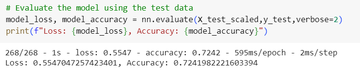

# Deep Learning Challenge

## Background
The nonprofit foundation Alphabet Soup wants a tool that can help it select the applicants for funding with the best chance of success in their ventures. The foundation has provided a CSV file containing more than 34,000 organizations that have received funding from them over the years. This dataset contains metadata for each organization including the following:

* EIN and NAME—Identification columns
* APPLICATION_TYPE—Alphabet Soup application type
* AFFILIATION—Affiliated sector of industry
* CLASSIFICATION—Government organization classification
* USE_CASE—Use case for funding
* ORGANIZATION—Organization type
* STATUS—Active status
* INCOME_AMT—Income classification
* SPECIAL_CONSIDERATIONS—Special considerations for application
* ASK_AMT—Funding amount requested
* IS_SUCCESSFUL—Was the money used effectively

## Overview of Analysis
The purpose of the analysis is to build a deep learning model to preduct whether or not an applicant will be successful if they receive funding. To standardize and maximize memory and processing resources, the analysis was completed in Google Collaboratory in a Jupyter notebook. The process for analyzing the data is described as follows:
1. Read in the CSV file into a Pandas dataframe.
2. Preprocess the data.
    * Remove unnecessary columns.
    * Identify categorial columns with 10 or more categories and reduce to less than 10.
    * Convert categorial columns to numeric using Pandas get_dummies method.
    * Identify and separate the target from the features data.
    * Split the data into a training and test dataset.
    * Fit the training dataset and scale the training and test datasets.
3. Define and compile the model.
4. Train the model using the training dataset.
5. Evaluate the model using the test dataset.
6. Save the model in HDF5 format.

Note: The saved model is available at https://medium.com/@ml_kid/how-to-save-our-model-to-google-drive-and-reuse-it-2c1028058cb2.

## Results
As indicated above the model was trained to maximize accuracy. This resulted in the following.

## Summary and Conclusions
